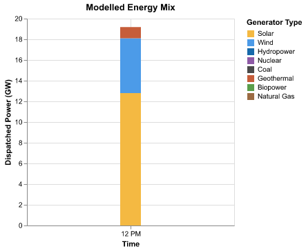
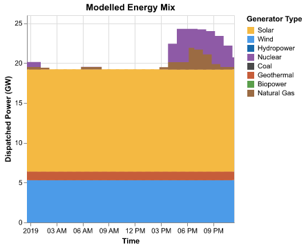
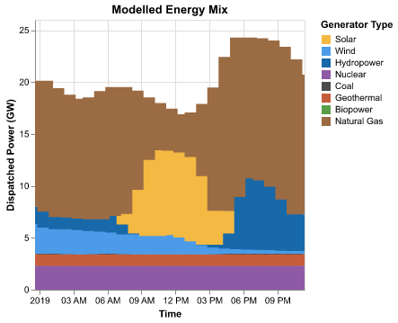

# Coding challenge: Build an electrical dispatch model

In this coding challenge, you will build a simplified electrical dispatch model. Dispatch models are used by electrical grid operators to determine which power plants should run when.

This coding challenge was developed for the PowerUp 2026 conference in Boulder, Colorado and uses data from the California Test System[^1].

[^1]: Taylor, S. et al. California Test System (CATS): A Geographically Accurate Test System Based on the California Grid. Policy and Regulation IEEE Transactions on Energy Markets 2, 107–118 (2024).

!!! tip "Use agentic AI judiciously"

    Agentic AI tools like Claude Code can certainly "solve" this coding challenge for you. But, you might learn more (and have more fun!) if you avoid such tools for this challenge. The concepts taught in this challenge continue to be useful to serious modelers that wish to better understand how modeling frameworks work, how to effectively guide AI agents, and how to improve the performance of their code. Remember, the point is to learn, not to solve my made-up and meaningless coding challenge!
    
## A. Set up project

1. Run the following command to install Pyoframe, HiGHS (a free solver), Altair (a plotting library), and pandas.

    ```bash
    pip install pyoframe[highs] altair[save] pandas
    ```

    If you prefer using another solver like Gurobi, refer to our [installation instructions](../get-started/installation.md). Also note that we will use pandas since that is what most people are comfortable with, but Pyoframe works equally well with polars if you prefer (in fact, under-the-hood, Pyoframe uses Polars for everything).

2. Download and unzip the data and starter code for this challenge.

    [:material-folder-download: Download data and starter code](https://github.com/Bravos-Power/pyoframe/raw/refs/heads/main/docs/learn/practice/dispatch_challenge/starter_code_for_dispatch_challenge.zip){.md-button}

3. Run `main.py`. It shouldn't produce any errors and should print:

    ```bash
    No results to plot.
    ```

## B. Get familiar with the data

The `input_data` folder contains several files. For now, you only need to inspect the following two files:

1. **`generators.parquet`**: a table containing one row per power generator. For now, you will only need the following columns:

    - `gen_id`, a unique ID for each generator
    
    - `Pmax`, the maximum power the generator can output (in MW)
    
    - `cost_per_MWh_linear`, the (linearized) cost of producing one MWh of energy 
    
2. **`loads.parquet`**: a table for the electrical demand at every hour and electrical bus

!!! tip "Parquet files"

    Parquet files are a modern, machine-readable alternative to .csv files. You can inspect them using the [Data Wrangler extension](https://marketplace.visualstudio.com/items?itemName=ms-toolsai.datawrangler) in VSCode, or by simply adding a line in `main.py` to print the corresponding DataFrame. 

## C. Build a single-timestep, copper-plate model

To being, you will build the simplest possible dispatch model: a single-timestep, copper-plate model. Copper-plate models are simplistic models that assume unlimited, lossless transmission between regions, as if all power generators and loads were located in the same region (or on the same copper plate). As such, this model has neither a spatial or temporal component.

Build the model in `main.py` using the two previously mentioned data files. You will need to add the following 6 lines of code beneath the `YOUR CODE GOES HERE` comment.

1. A line to create the Pyoframe [`Model` object](../develop/create-a-model.md) that forms the basis of the model.

2. A line to add a [`Dispatch` variable](../develop/create-variables.md) to the model. The variable should by indexed ("dimensioned") over the `gen_id` column and should have both a lower and upper bound. The upper bound should come from the `Pmax` column.

3. A line to [create a constraint](../develop/create-constraints.md) that ensures the total `Dispatch` is greater than the `MIDDAY_LOAD`. This is your power balance constraint.

4. A line to [set the objective function](../develop/define-objective.md). The objective should be to minimize the total cost which is the sum of the product of `Dispatch` with `cost_per_MWh_linear`.

5. A line with [`.optimize()`](../develop/run-and-configure-the-solver.md) to solve the model.

6. A line to [retrieve the solution for `Dispatch`](../develop/read-results.md) and return it. Note that the `main` function must return the solution for the plotting to work.

!!! tip "Key Pyoframe concepts"

    Building this model will require understanding two important Pyoframe concepts

    1. Pyoframe objects including variables, expressions, and constraints can be either dimensionless (e.g., a single constraint) or dimensioned (e.g., several constraints indexed over a dimension). For example, the `Dispatch` will need to be dimensioned over the `gen_id` dimension since we want one variable for every generator.

    2. Pyoframe will automatically convert DataFrames into Pyoframe expressions according to a convenient rule: the last column is assumed to be the expression's value while all previous columns become the expressions' dimensions. So, if you'd like to create a dimensioned Expression for the cost of a generator, you'll need to select two columns `df_generators[["gen_id", "cost_per_MWh_linear"]]`.

If successful, running your code should result in the following plot!



## D. Add time to your model

The above model only model power generation at noon. Let's extend it to all 24 hours of our data.

Update your power balance constraint to use the full load timeseries (`df_load`) instead of just the load at mid-day (`MIDDAY_LOAD`). Note that you'll need to change your `Dispatch` variable since we now want one variable for every generator _and every hour_.

!!! tip "Conflicting dimensions and `.sum_by`"

    1. Try simply swapping `MIDDAY_LOAD` for `df_load`. What error do you observe? What does it mean?

    2. Hint: [`.sum_by`][pyoframe.Expression.sum_by] might be useful when updating your power balance constraint.

After your modifications, your code should produce the following plot.



## E. Integrate Variable Capacity Factors

Notice anything weird in the previous plot? Solar power is being produced at night! This is because the only constraint on solar generation is the total capacity of the solar farm, unrelated to the sunlight at that time of day.

Add one additional constraint to limit the `Dispatch` of variable generators (like Solar and Wind) using the variable capacity factors in the `variable_capacity_factors.parquet` file. Variable capacity factors are ratios (e.g., `0.6`) that indicate the fraction of the generators' `Pmax` that can be produced at a given time based on historical conditions.

!!! tip "Hints"

    1. You might find it helpful to complete this task in two steps. First, build a DataFrame containing the maximum generation limit at every hour (i.e., the product of the capacity factor with `Pmax`), then use that DataFrame to create a new constraint. Pandas' [`.merge`](https://pandas.pydata.org/docs/reference/api/pandas.DataFrame.merge.html) method might be helpful when creating the DataFrame.

    2. Since not all generators are renewable generators with capacity factors, you will face a `PyoframeError`. [Learn to use](../concepts/addition.md#keep_extras-drop_extras) `.keep_extras()` or `.drop_extras()` to tell Pyoframe whether these "extra" generators should or shouldn't be kept in the constraint.

Your results should now look like this. This looks much more realistic!



## F. Bonus: Add bulk transmission

If you'd like an extra challenge, use the data in `lines.parquet` to add transmission to the model. You'll need to define a new variable for the transmitted amount on each line at every timepoint, and then use this power transfer variable in your power balance constraint. This is a rather large model so you might not be able to run it on your personal computer.